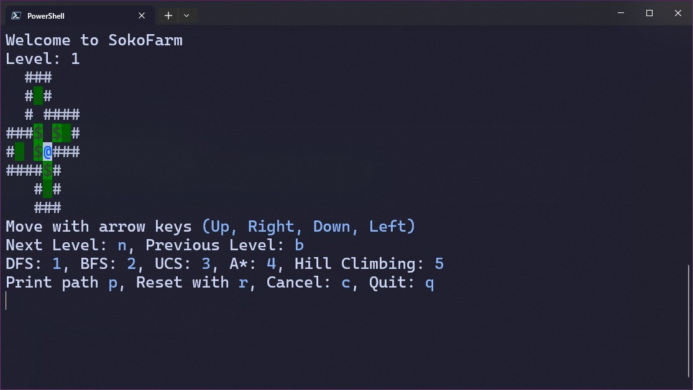
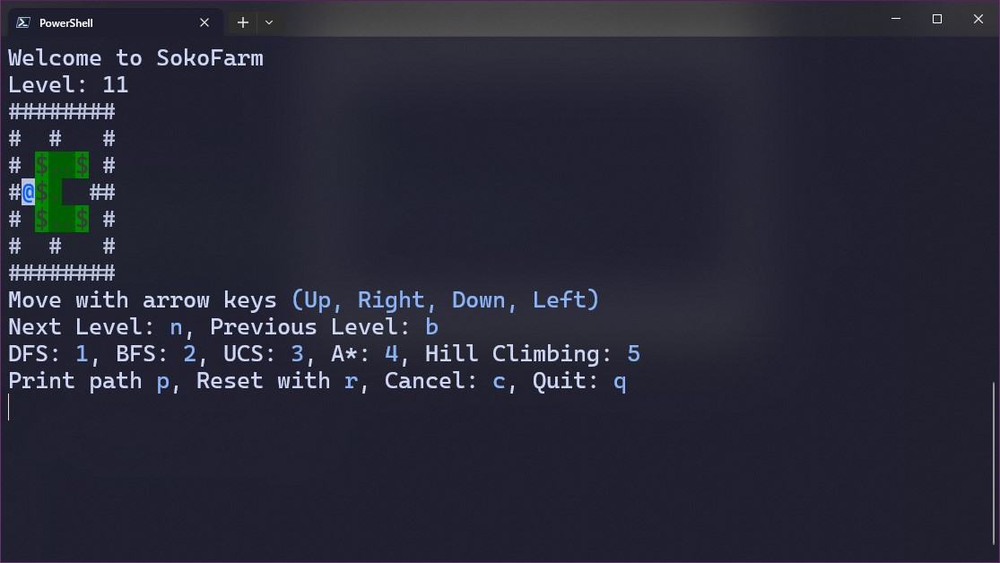

# SokoFarm

SokoFarm is a console-based game where the player moves around a grid, trying to get all the seeds into the storages.

## Features

- 100 Unique levels
- Ability to add more levels
- Ability to solo playing
- Self solving using various algorithms (DFS, BFS, UCS, A\*, HillClimbing)
- Ability to cancel algorithms execution using CancellationToken

## Preview

## Getting Started

These instructions will get you a copy of the project up and running on your local machine for development and testing purposes.

### Prerequisites

What things you need to install the software and how to install them

- .NET 8 or higher

### Installing

A step by step series of examples that tell you how to get a development environment running

1. Clone the repository
1. Navigate to the project directory
1. Run `cd src`
1. Run `dotnet build` to build the project
1. Run `dotnet run` to start the game

## Built With

- [.NET Core](https://dotnet.microsoft.com/download)

If you like it give it a star ✨✨
